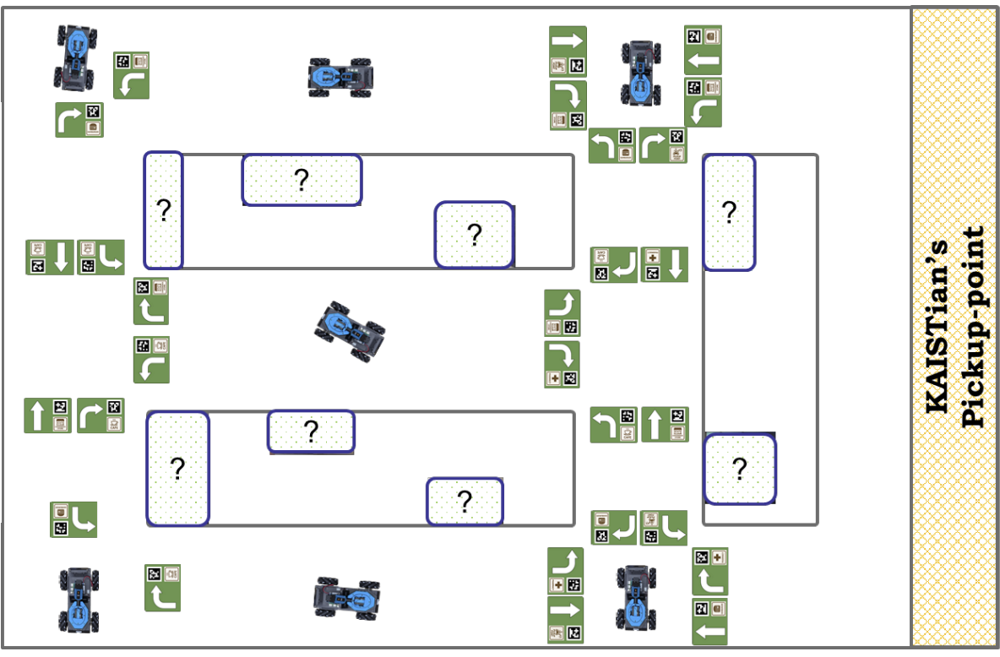
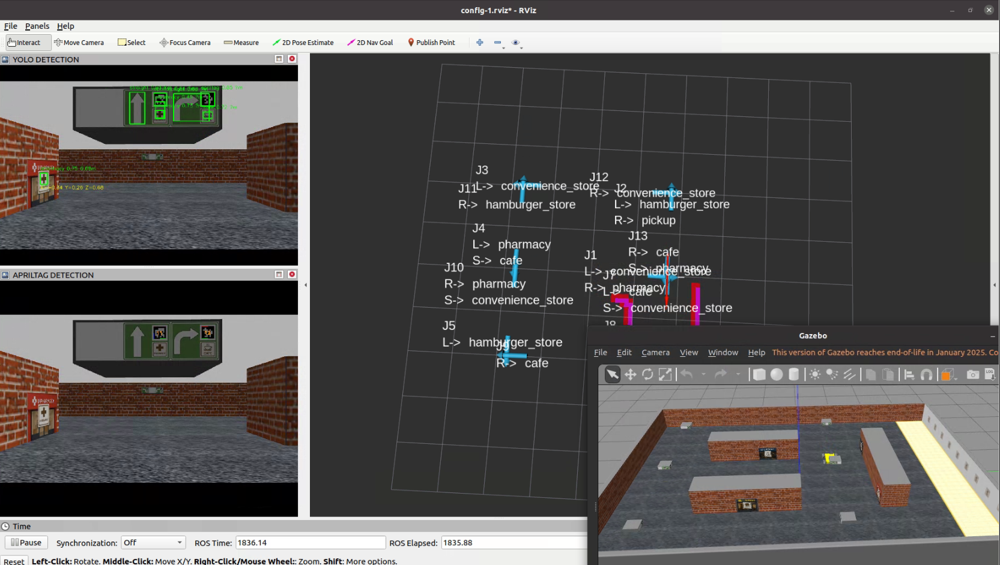

# LLM-Based Agentic Exploration in Gazebo (ROS Noetic)

A ROS/Gazebo simulation stack for **agentic robot exploration and task execution** in a corridor-style “shopping” environment. The robot builds a lightweight **semantic map** from signboard cues (directions + store icons + AprilTags), then uses an **LLM-driven (or deterministic) junction policy** to choose actions, while a **finite-state main controller** triggers low-level motion primitives for navigation and object pickup.

> This repository covers the **Gazebo simulation** version (not the real-world setup).

---

## How to Run the Simulation (Required)

This project runs as a **two-launch setup** inside the **catkin workspace**:
1) **Main simulator**: starts Gazebo world + simulation stack  
2) **Main controller**: starts the FSM orchestrator and behavior controllers

> Open **two terminals** and run the following **from `catkin_ws/`**.

### Terminal 1 — Launch the Gazebo Simulator (main_simulator)
```bash
cd catkin_ws
source devel/setup.bash
roslaunch main_simulator main_launcher.launch
```
### Terminal 2 — Launch the Main Controller (robot_controller)
```bash
cd catkin_ws
source devel/setup.bash
roslaunch robot_controller main_controller.launch
```

---

## Visual Overview

### 1) Environment Map Layout
  
*Figure: Corridor-style map layout used in simulation. Junction signboards provide directional arrows, store icons, and AprilTags; a pickup zone is placed on the right side.*

### 2) Gazebo Simulation World

*Figure: Gazebo world instance of the shopping environment, including corridor structures, store entrances, and signboards placed at key junctions.*

### 3) System Runtime in RViz + Gazebo
  
*Figure: Runtime visualization during exploration. Left: perception streams (e.g., YOLO detections / AprilTag view). Center: RViz semantic-map and trajectory. Bottom-right: Gazebo simulation view.*

---

## Key Features

- **Agentic exploration loop**: explore → map junction semantics → decide next action → execute skills
- **Semantic mapping**: JSON-like junction graph with direction-to-POI/store relations
- **LLM navigation policy (constrained output)**: outputs discrete action like `<direction>|||<store_action>`
- **Modular low-level controllers (ROS topics)**:
  - local-costmap **wall avoidance**
  - **AprilTag approach** for precise alignment at signboards/entrances
  - **store pre-enter / enter** routines (centering + entry)
  - **grasping trigger** (handoff to pickup/grasp node)

---

## System Overview (High-Level)

**Perception & Mapping**
- YOLO-based detection for **store icons / arrows / grasp targets** (and optional “negative” samples to reduce false positives)
- AprilTag detections used as **robust anchors** at junctions/entrances
- Local occupancy/costmap for safe corridor navigation

**Decision Layer**
- An LLM (or deterministic policy) selects **left/straight/right** and whether to **enter a store now** vs **continue**

**Execution Layer**
- A `MainController` FSM gates behaviors so only one module commands `/cmd_vel` at a time.

---

## Tech Stack

- **OS / Middleware**: Ubuntu 20.04 + **ROS Noetic**
- **Simulation**: Gazebo (commonly Gazebo 11 with Noetic)
- **Perception**: **YOLO (Ultralytics, YOLO11-small)** for detection (icons/arrows/objects/etc.)
- **Fiducials**: `apriltag_ros` (`AprilTagDetectionArray`)
- **Navigation Safety**: local occupancy grid / costmap → wall-avoid FSM
- **Controller Orchestration**: ROS topics + finite-state machine gating
- **LLM**: constrained high-level policy over the semantic map

---

## Prerequisites

1. ROS Noetic installed and working (`roscore` runs)
2. Gazebo working with ROS (`gazebo_ros` packages)
3. Python 3 dependencies (if using YOLO/LLM nodes):
   - `opencv-python`
   - `ultralytics`

Example:
```bash
sudo apt update
sudo apt install -y python3-pip ros-noetic-apriltag-ros ros-noetic-tf ros-noetic-cv-bridge
pip3 install ultralytics opencv-python
